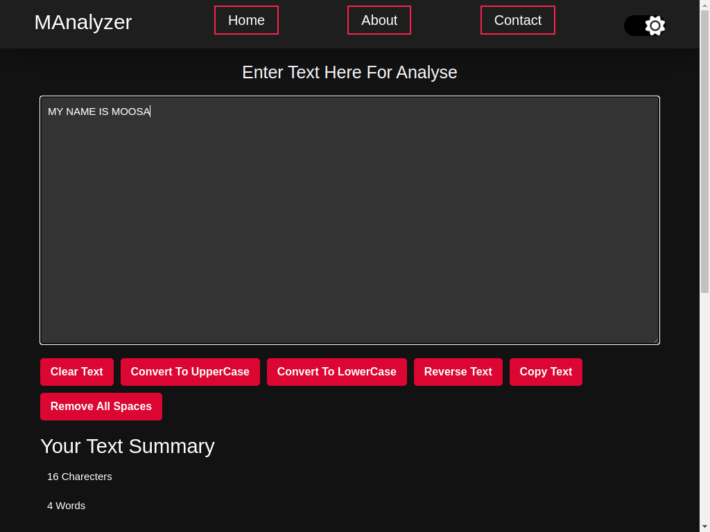

# Get Started With Manalyzer Web Application



This project was Created By **Moosa Raheel**

This site was build in React Js

## clone the project

```bash
git clone https://github.com/moosa-raheel/manalyzer.git
cd manalyzer
yarn install
yarn start
```

---

## Features of Manalyzer

> - Convert UpperCase to lowerCase
> - Convert lowerCase to UpperCase
> - Remove All Spaces
> - Reverse the Text
> - Remove all spaces

Runs the app in the development mode.\
Open [http://localhost:3000](http://localhost:3000) to view it in your browser.

The page will reload when you make changes.\
You may also see any lint errors in the console.

### `npm test`

### `npm run build`

Builds the app for production to the `build` folder.\
It correctly bundles React in production mode and optimizes the build for the best performance.

The build is minified and the filenames include the hashes.\
Your app is ready to be deployed!

This Project is already hosted
[https://manalyzerm.netlify.app](https://manalyzerm.netlify.app "Visit the website")
